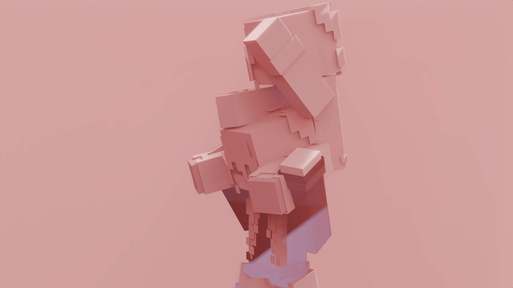
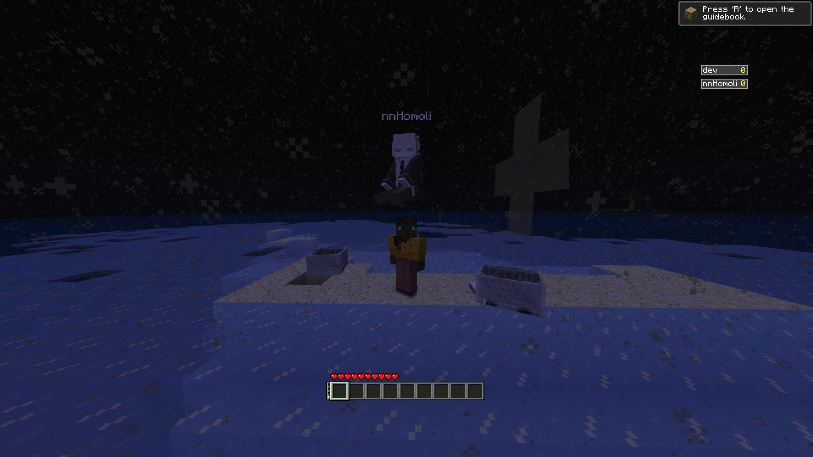
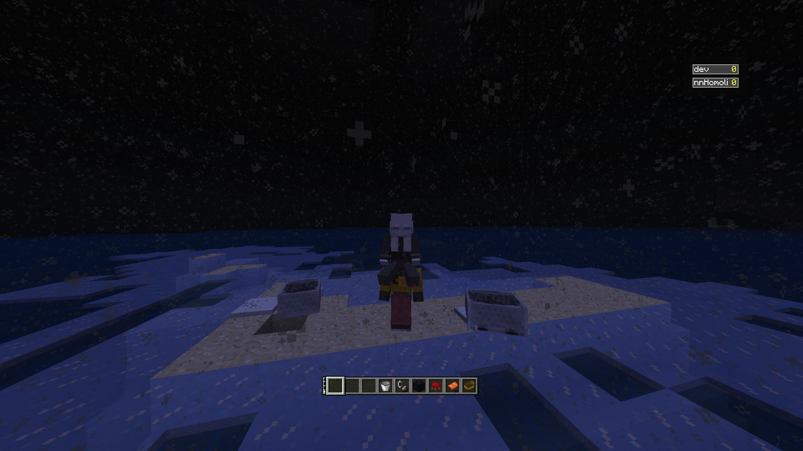

# Better Together



This mod adds server-sided riding on players for "[Better Than Adventure!](https://www.betterthanadventure.net/)" fork-mod

## Config

```
player-towering=true||false
```
If true, it will allow players to do towers.
False by default
```
player-pickup=true||false
```
If true, it allows the player to be picked up while sneaking.
False by default
```
vehicle-eject=true||false
```
If the player attacks their own passenger, it will eject them.
True by default
```
vehicle-limit=true||false
```
If true, the player with the passenger wouldn't be able to ride other entities, this does not affect tile entities, aka seat.
True by default


## Gallery

 

