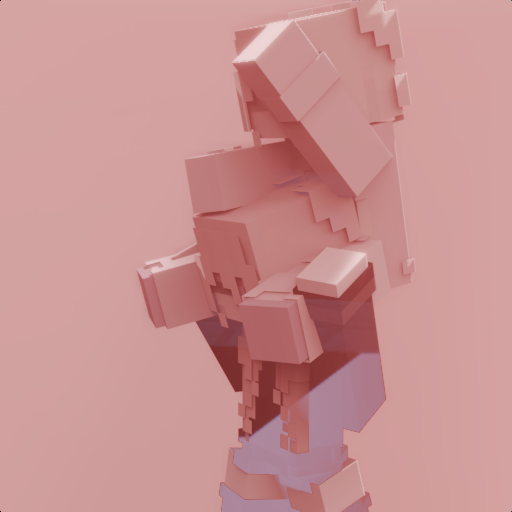

# Better Together



This mod adds server-sided riding on players for "[Better Than Adventure!](https://www.betterthanadventure.net/)" fork-mod

## Config

```
player-towering=true||false
```
If true, it will allow players to do towers.
False by default
```
vehicle-eject=true||false
```
If the player attacks their own passenger, it will eject them.
True by default

## Gallery

 

